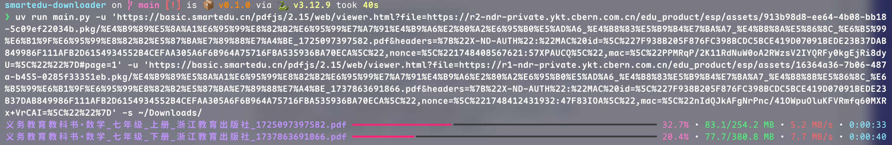

# [国家中小学智慧教育平台](https://basic.smartedu.cn/tchMaterial/) 电子教材下载工具（命令行）

本工具可以帮助您从[**国家中小学智慧教育平台**](https://basic.smartedu.cn/)下载指定的课本PDF文件。

## 特点及示例
- 命令行，无GUI，兼容主流操作系统；
- 支持一次下载多个文件；

## 使用方法
- 前提：`python3`环境，并且已安装 [`uv`](https://github.com/astral-sh/uv) 
- 命令：`uv sync && uv run main.py -u 'https://xxx.com/xxxxxx?xxx=xxxx&xxx=xxxx' -u 'https://xxx.com/xxx?xxx=xxx' -s '~/Download/'`

## 如何获取下载地址

- 使用chrome浏览器找到要下载的教材并预览；
- 打开chrome调试工具(Windows 按 F12, MacOS 按 option + command + i);
- 点击 Network（1） 选项卡，在 Filter（2） 中输入 `viewer.html` 进行过滤；
- 在下方 Name (3) 处选中过滤出来的结果，右侧 `Request Url` （4）就是下载地址，将其复制到命令行工具进行下载即可。

## 免责声明
本工具仅用于学习测试，请不要用于非法途径，否则一切后果由使用者自行承担。